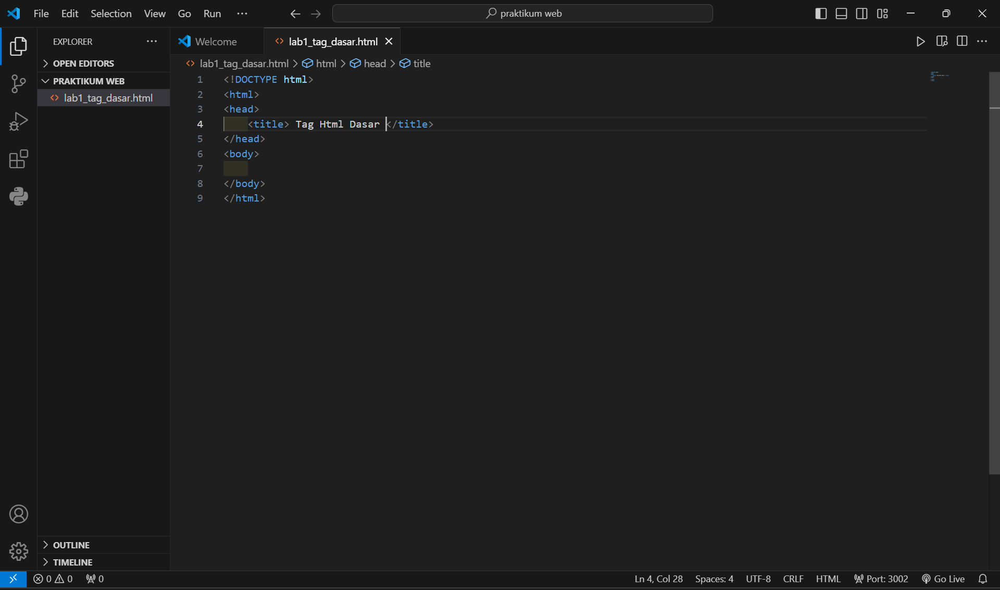
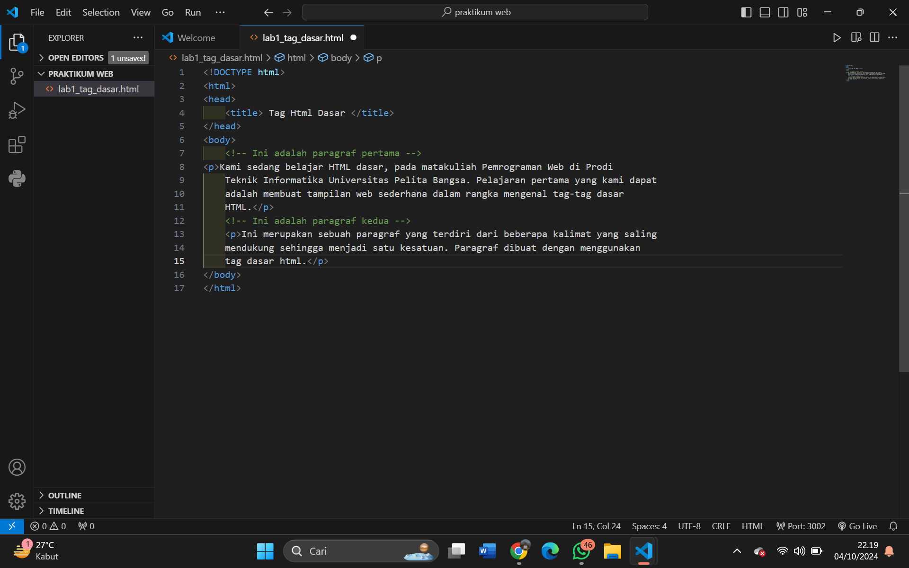
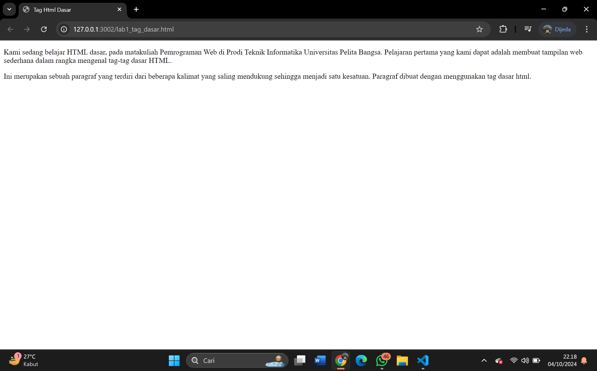
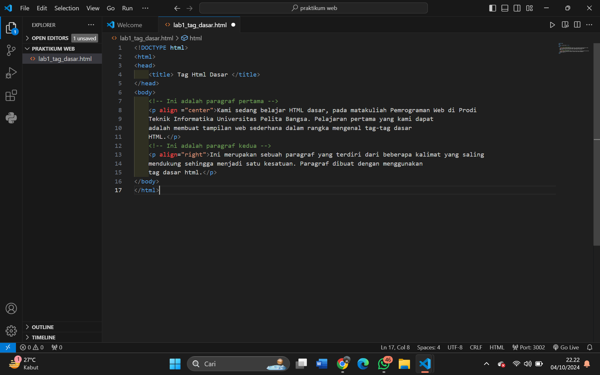
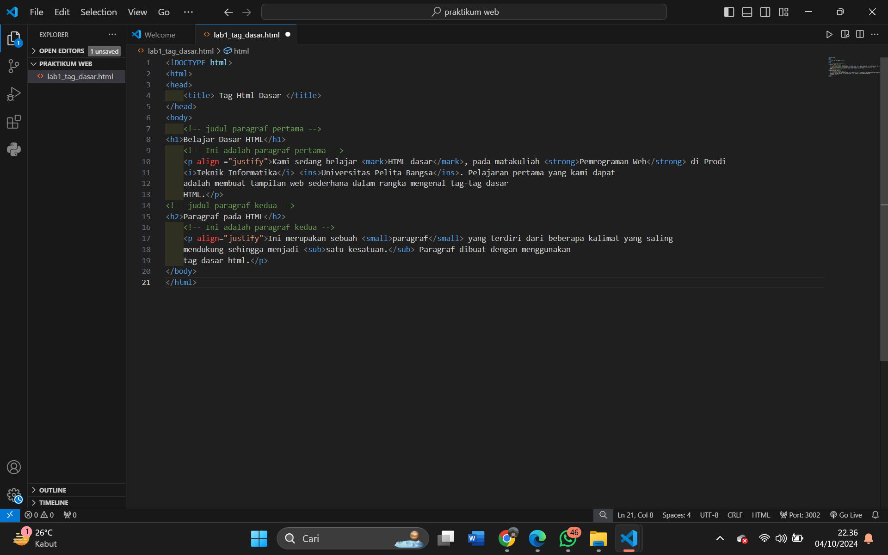
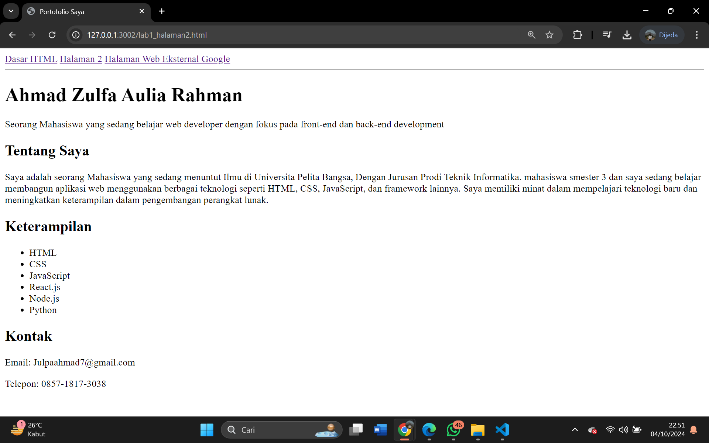

# Tugas Praktikum Pemrograman Web

#### Membuat file baru dengan nama lab1_tag_dasar.html dan tambahkan tag dasar dokumen 

#  

#### 1. Membuat paragraf

Hasil : 

Menambahkan Algin :

Hasil :
# 

### 2. Menambahkan Judul 

Hasil:
### 

### 3. Meformat Teks

Hasil:
### 

### 4. Menyisipkan Gambar

Hasil:
# 

### 5. Menambahkan Hyperlink

Hasil:

# 

### Halaman 2

# 

## Pertanyaan

1. Lakukan perubahan pada kode sesuai dengan keinginan anda, amati perubahannya adakah error ketika terjadi kesalahan penulisan tag?
2. Apa perbedaan dari tag `
` dengan tag ` `, berikan penjelasannya!
3. Apa perbedaan atribut title dan alt pada tag ``, berikan penjelasannya!
4. Untuk mengatur ukuran gambar, digunakan atribut width dan height. Agar tampilan gambar proporsional sebaiknya kedua atribut tersebut diisi semua atau tidak? Berikan penjelasannya!
5. Pada link tambahkan atribut target dengan nilai atribut bervariasi ( _blank, _self, _top, _parent ), apa yang terjadi pada masing-masing nilai antribut tersebut?

### Jawab :
1. Salah satu perubahan yang saya buat adalah menambahkan tag `<h1>` di dalam tag `
` yang tidak sesuai aturan HTML. `
` Ini contoh perubahan kode. `<h1>`Heading di dalam paragraf`</h1>` 
`
` 
Browser masih dapat menampilkan halaman, tetapi struktur halaman HTML menjadi tidak sesuai karena `<h1>` tidak boleh berada di dalam tag `
`. Browser akan mencoba "memperbaiki" kesalahan ini dengan menutup tag `
` sebelum tag `<h1>`, namun ini tidak dianjurkan karena membuat kode tidak valid dan bisa menyebabkan tampilan tidak sesuai yang diinginkan.

2. <strong>Tag</strong> `
` (paragraph) digunakan untuk mendefinisikan satu blok paragraf dalam HTML. Paragraf mencakup satu atau lebih kalimat dan menciptakan jarak antar-paragraf. 
<strong>Tag</strong> ` ` (break) digunakan untuk membuat baris baru tanpa memulai paragraf baru. Tag ini tidak memiliki penutupan.

3. Atribut `alt` (alternative text) digunakan untuk memberikan teks alternatif yang muncul jika gambar gagal dimuat. Teks ini juga digunakan oleh pembaca layar untuk aksesibilitas. 
Atribut `title` digunakan untuk menampilkan teks sebagai tooltip ketika pengguna mengarahkan kursor ke gambar. Ini memberikan informasi tambahan tentang gambar. 

4. Hanya mengatur salah satu (misalnya `width` atau `height`): Gambar akan otomatis menyesuaikan ukuran sisi lainnya sesuai rasio aslinya, sehingga gambar tetap proporsional. 
Mengatur kedua atribut: Jika tidak sesuai dengan rasio asli gambar, ini bisa menyebabkan gambar menjadi tidak proporsional dan terdistorsi.
Sebaiknya Mengatur salah satunya saja.

5. `_blank`: Membuka link di tab atau jendela baru. 
`_self`: Membuka link di tab atau jendela yang sama (default behavior). 
`_top`: Membuka link di jendela penuh, keluar dari semua frame. 
`_parent`: Membuka link di jendela induk jika halaman berada dalam frame.